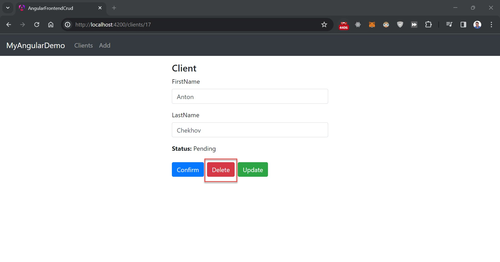
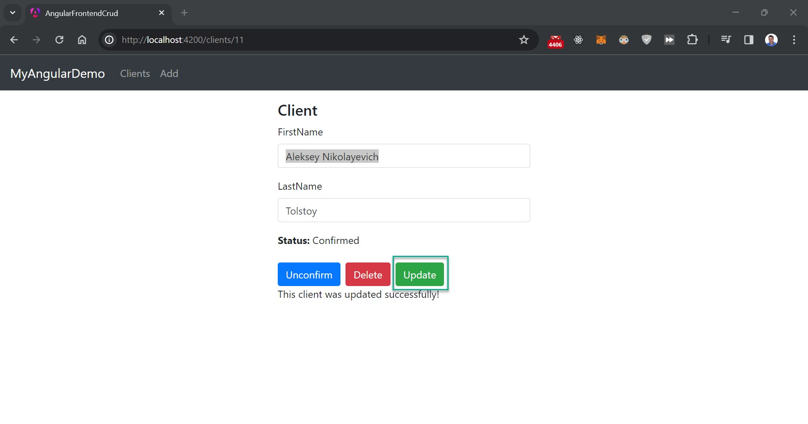

# AngularFrontendCrud

This project was generated with [Angular CLI](https://github.com/angular/angular-cli) version 17.1.3.

## Development server

Run `ng serve` for a dev server. Navigate to `http://localhost:4200/`. The application will automatically reload if you change any of the source files.

## Code scaffolding

Run `ng generate component component-name` to generate a new component. You can also use `ng generate directive|pipe|service|class|guard|interface|enum|module`.

## Build

Run `ng build` to build the project. The build artifacts will be stored in the `dist/` directory.

## Running unit tests

Run `ng test` to execute the unit tests via [Karma](https://karma-runner.github.io).

## Running end-to-end tests

Run `ng e2e` to execute the end-to-end tests via a platform of your choice. To use this command, you need to first add a package that implements end-to-end testing capabilities.

## Further help

To get more help on the Angular CLI use `ng help` or go check out the [Angular CLI Overview and Command Reference](https://angular.io/cli) page.


Import Bootstrap into Angular Project
Open index.html and add following line into <head> tag:
```
<!DOCTYPE html>
<html lang="en">
  <head>
    ...
    <link rel="stylesheet" href="https://unpkg.com/bootstrap@4.6.0/dist/css/bootstrap.min.css" />
  </head>
  ...
</html>
```


`npm install bootstrap@4.6.2`


Bootstrap module with command: npm install bootstrap@4.6.2.
Then add following code into angular.json:

```
"styles": [
"node_modules/bootstrap/dist/css/bootstrap.min.css",
"src/styles.css"
],
"scripts": [
"node_modules/jquery/dist/jquery.slim.min.js",
"node_modules/popper.js/dist/umd/popper.min.js",
"node_modules/bootstrap/dist/js/bootstrap.min.js"
]
```






